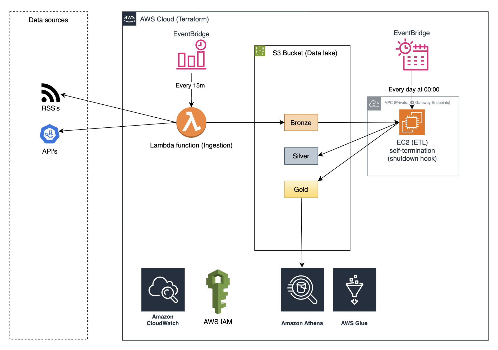

# Infrastructure (Terraform)
This repository contains the full Infrastructure-as-Code setup for news data platform.
All components are provisioned and managed via Terraform.

# Setup
## Prerequisites
- Terraform ≥ 1.14.0
- AWS CLI configured
- S3 backend for Terraform state (recommended)
- IAM access with rights to create VPC, EC2, Lambda, S3, IAM roles

## How to deploy
```bash
# Initialize Terraform
$ terraform init

# Plan
$ terraform plan

# Apply
$ terraform apply

# Destroy (if needed)
$ terraform destroy
```

# Diagram

